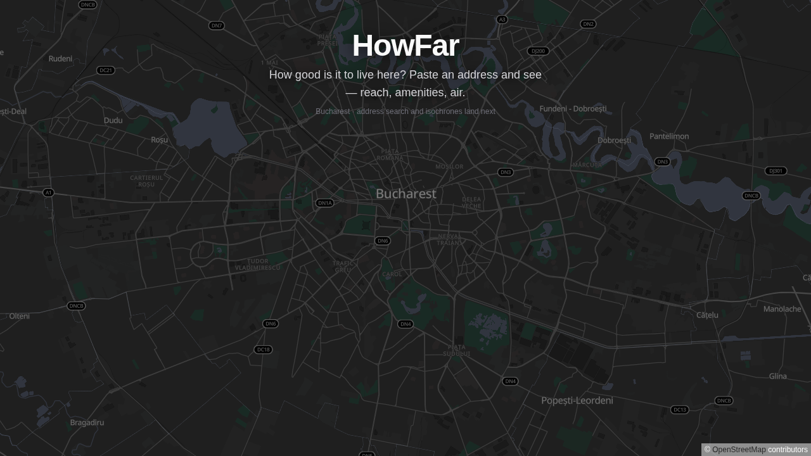

# HowFar — Neighborhood Livability Explorer

Turn any Bucharest address into an instant, visual **"how good is it to live here?"** map:
isochrones (how far 15/30/45 minutes really take you on foot and by public transport) and
nearby essentials — built on free, public data. Air quality and a transparent 0–100 livability
score are planned next (not shipped yet).



> **Status: M2 in progress — live at
> [howfar-production-b31c.up.railway.app](https://howfar-production-b31c.up.railway.app).**
> Working today: address search with type-ahead suggestions (or click anywhere on the map),
> walking **and** public-transport isochrones (15/30/45 min), nearby essentials in five
> categories, inspectable places and transit lines, and full route paths with named stops.
> The responsive dark map UI uses a search-first command surface, adaptive result sheet,
> keyboard place browser, touch gestures, and reduced-motion-aware map transitions.
> Transit reachability is computed in-process from per-stop travel times — no provider
> offers transit isochrones. Foundation from
> M0/M1 underneath: PostgreSQL/PostGIS + Prisma persistence, expiring provider cache, social
> sign-in, tests + [CI green](https://github.com/joitamihnea1999/HowFar/actions), Railway
> deploy over private networking. Next in M2: air-quality summary and the transparent
> livability score. Custom domain: not yet attached.
> Docs: [`docs/BRIEF.md`](docs/BRIEF.md) (product brief) ·
> [`docs/ARCHITECTURE.md`](docs/ARCHITECTURE.md) (code tour, provider checklist) ·
> [`docs/PROVIDERS.md`](docs/PROVIDERS.md) (verified data-provider decisions).

## Stack

TypeScript (strict) · Next.js 16 (App Router, one full-stack repo) · Tailwind CSS 4 ·
MapLibre GL + self-hosted [Protomaps](https://protomaps.com) tiles · PostgreSQL 17/PostGIS 3.5 + Prisma 7 ·
Auth.js v5 (Google/GitHub) · Vitest + Playwright · Railway

Data (live): Nominatim (geocoding) · OpenRouteService (walking isochrones) ·
[Transitous](https://transitous.org) / MOTIS (transit reachability) · a weekly OSM/Overpass
amenity snapshot stored in PostGIS. **Planned:** Open-Meteo (climate + air quality) and the
0–100 score. External calls are server-side and cached where appropriate; amenity discovery
itself is a local spatial query, so nearby user clicks never hit Overpass. Tiles are served
from a 25 MB Bucharest extract by the app itself — **no client-side API keys anywhere**.

## Local development

Requirements: Node 24.x (`.nvmrc`), Docker.

```bash
nvm use                     # Node 24.x (see .nvmrc)
npm ci                      # also runs prisma generate
docker compose up -d db     # PostgreSQL 17 + PostGIS 3.5 on localhost:5433
cp .env.example .env        # fill AUTH_SECRET (npx auth secret); defaults fit the compose DB
npx prisma migrate deploy   # create tables
npm run amenities:refresh -- --snapshot scripts/amenities/fixtures/catalogue-overpass.json # optional fixture seed
npm run tiles:fetch         # one-time ~25MB Bucharest basemap extract
npm run dev                 # http://localhost:3000
```

### Scripts

| Command | What it does |
| --- | --- |
| `npm run dev` / `build` / `start` | Next.js dev / production build / serve |
| `npm run check` | Lint + typecheck + unit suite — the sub-minute local loop |
| `npm run check:ci` | `check` + production build (what CI gates, minus e2e) |
| `npm run lint` · `npm run typecheck` | ESLint · `tsc --noEmit` |
| `npm test` · `npm run test:coverage` | Vitest unit suite · same with enforced coverage thresholds |
| `npm run test:e2e` | Playwright e2e (needs `npm run build` first + DB up) |
| `npm run tiles:fetch [YYYYMMDD]` | (Re)fetch the Bucharest basemap extract |
| `npm run amenities:refresh` | Fetch, validate and atomically publish the weekly Bucharest OSM catalogue |
| `npm run security:google-keys` | Value-safe scan of the working tree, Git index, and full history |

### Secret safety

Keep real credentials only in ignored `.env` files locally and in Railway variables for
deployment. Google credentials must remain server-side and must never use a `NEXT_PUBLIC_`
name. This clone uses the committed pre-commit scanner; enable it in another clone with
`git config core.hooksPath .githooks`. CI repeats the scan against the complete Git history.

### Health endpoints

- `GET /api/health` — liveness: always 200, reports `{ ok, db }` (DB probe bounded at 2 s).
- `GET /api/ready` — readiness: 200 only when PostgreSQL, PostGIS and the migration history are available.
- `GET /api/catalogue-status` — 200 for a fresh active amenity snapshot; 503 if missing, stale (>10 days), or unavailable.
- `GET /api/catalogue-export?limit=500&after=…` — paginated GeoJSON export of only the OSM-derived catalogue.

## CI

`.github/workflows/ci.yml` runs on every push/PR: **lint → typecheck → unit (with coverage
thresholds) → build**, plus an **e2e job** with PostGIS 3.5, empty-database migrations,
real catalogue integration tests, a cached basemap extract, and Playwright against the production build.

## Deploying to Railway

`railway.json` is committed (build fetches tiles; start runs `prisma migrate deploy`;
healthcheck = `/api/ready`). One-time setup — **order matters**: connecting the repo triggers
an immediate deploy, and the start command's migration needs the database and env first.

1. Create an empty Railway project (Hobby plan — the Trial pauses after 30 days).
2. Add a **PostgreSQL service with PostGIS enabled** and wait for it to provision. Verify
   `CREATE EXTENSION postgis` is allowed before touching the current app service.
3. Create the app service **empty** (no source) and set its variables now:
   `DATABASE_URL` as a Railway variable *reference* to the PostgreSQL service's
   **private-network** URL, and
   `AUTH_SECRET` (`npx auth secret`). Optional: `AUTH_GOOGLE_ID/SECRET`,
   `AUTH_GITHUB_ID/SECRET` (OAuth callback: `https://<domain>/api/auth/callback/<provider>`),
   `ORS_API_KEY`.
4. Only now connect this GitHub repo to the app service (auto-deploys `main`) and wait for
   the deploy to pass the `/api/ready` healthcheck. Generate a public URL
   (`railway domain`) or attach a custom domain.
5. Create a second service from the same repo for the importer, set its config-file path to
   `/railway.importer.json`, share the private `DATABASE_URL` and `AUTH_SECRET`, and keep its
   committed Sunday 03:00 UTC schedule. Its process exits after every run; failures retry twice.

Production already runs PostgreSQL 17 + PostGIS only (the former MySQL service was removed).
New environments should provision PostGIS from day one as above — there is no MySQL path in
this repository.

## Attribution

Map data © [OpenStreetMap](https://www.openstreetmap.org/copyright) contributors ·
Basemap tiles: [Protomaps](https://protomaps.com) ·
Transit routing: [Transitous](https://transitous.org/sources/) ·
Geocoding: [Nominatim](https://nominatim.org) ·
Weather & air quality (planned): [Open-Meteo](https://open-meteo.com) (CC BY 4.0)

The amenity catalogue is a Derived Database made from OpenStreetMap data and is available as
machine-readable GeoJSON through `/api/catalogue-export`. It is distributed under the
[Open Database License 1.0](https://opendatacommons.org/licenses/odbl/1-0/); application/auth/cache
tables are deliberately excluded.
